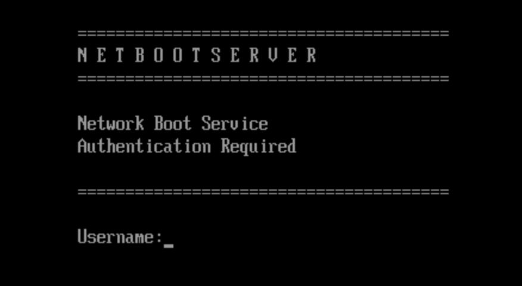
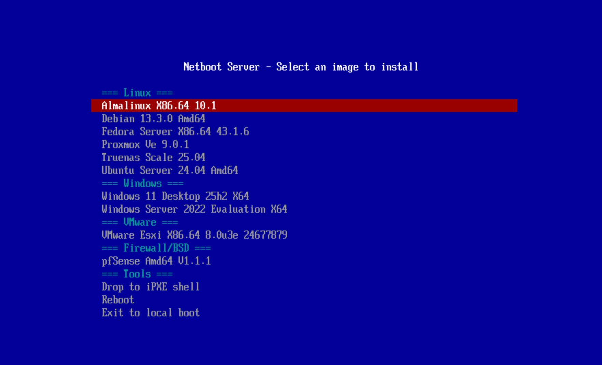

# Netboot Server

A self-hosted PXE boot server in Docker. Drop ISO files into a folder and network boot Windows, Linux, or VMware ESXi on any machine. Features authentication, automatic menu generation, and works alongside your existing DHCP server.

## Features

- **Multi-OS Support**: Windows, Ubuntu, Debian, Fedora, AlmaLinux, RHEL, Proxmox, TrueNAS, VMware ESXi
- **UEFI & Legacy BIOS**: Works with modern and older hardware
- **Authentication**: Local users (bcrypt) or LDAP/Active Directory
- **ProxyDHCP Mode**: Coexists with your existing DHCP server
- **Auto-Detection**: Automatically detects server IP at startup
- **Dynamic Menu**: Boot menu auto-generated from available images
- **Docker-based**: Single container, easy deployment

## Screenshots

| Login Screen | Boot Menu |
|--------------|-----------|
|  |  |

## Quick Start

```bash
# Clone the repository
git clone https://github.com/lbsobreira/netboot-server-pb.git
cd netboot-server-pb

# Run the start script (installs dependencies, configures, starts)
./start.sh

# Add an ISO image
cp /path/to/linux-ubuntu-server-24.04-amd64.iso images/

# Prepare the image for PXE boot
./scripts/prepare-images.sh

# PXE boot a client on your network!
```

## Requirements

- **Docker** and **Docker Compose**
- A server with a static IP on your LAN
- Network clients with PXE boot capability

## Installation

### 1. Clone and Setup

```bash
git clone https://github.com/lbsobreira/netboot-server-pb.git
cd netboot-server-pb

# Run the interactive setup
./start.sh
```

The start script will:
- Check for Docker and Docker Compose
- Prompt you to change the default password
- Configure your server IP
- Download required bootloaders
- Build and start the container

### 2. Add OS Images

Copy ISO files to the `images/` folder using the naming convention:

| OS Type | Naming Pattern | Example |
|---------|---------------|---------|
| Windows | `windows-<edition>-<version>-<arch>.iso` | `windows-11-pro-24h2-x64.iso` |
| Ubuntu | `linux-ubuntu-<edition>-<version>.iso` | `linux-ubuntu-server-24.04-amd64.iso` |
| Debian | `linux-debian-<version>-<arch>.iso` | `linux-debian-13.3.0-amd64.iso` |
| Fedora | `linux-fedora-<edition>-<version>.iso` | `linux-fedora-server-x86.64-43.iso` |
| AlmaLinux | `linux-almalinux-<version>.iso` | `linux-AlmaLinux-x86.64-10.1.iso` |
| Proxmox | `linux-proxmox-ve-<version>.iso` | `linux-proxmox-ve-9.0.1.iso` |
| TrueNAS | `linux-truenas-scale-<version>.iso` | `linux-truenas-scale-25.04.iso` |
| VMware ESXi | `vmware-esxi-<version>.iso` | `vmware-esxi-x86.64-8.0U3.iso` |

### 3. Prepare Images

```bash
./scripts/prepare-images.sh
```

This extracts boot files and generates the PXE menu automatically.

### 4. Boot a Client

1. Enable PXE/Network boot in the client's BIOS/UEFI
2. Boot the client - it will get the boot menu from netboot-server
3. Login with your credentials (default: `admin` / `netboot`)
4. Select an OS to install

## Windows PXE Boot Setup

Windows PXE boot requires Windows PE (WinPE) files built from the Windows ADK. Unlike Linux ISOs that work directly, Windows needs a special boot environment with SMB networking support to access installation files over the network.

**Why?** Retail Windows ISOs include a `boot.wim` designed for DVD/USB — it lacks the SMB client needed for network installation. The ADK WinPE has full networking support.

This is a **one-time setup**. The same WinPE files work for all Windows versions (10, 11, Server 2019, 2022, etc.).

### Step 1: Download and Install Windows ADK

On a Windows machine, download **both** installers from Microsoft:

1. Go to: https://learn.microsoft.com/en-us/windows-hardware/get-started/adk-install

2. Download and install **Windows ADK** (only "Deployment Tools" feature needed)

3. Download and install **Windows PE add-on for the ADK** (separate download, same page)

### Step 2: Create WinPE

Open **Start Menu** → search for **"Deployment and Imaging Tools Environment"** → **Run as Administrator**

```cmd
:: Create WinPE working directory
copype amd64 C:\WinPE
```

(Optional) Add extra components for scripting support:

```cmd
:: Mount the image
Dism /Mount-Image /ImageFile:C:\WinPE\media\sources\boot.wim /Index:1 /MountDir:C:\WinPE\mount

:: Add WMI and scripting support
Dism /Image:C:\WinPE\mount /Add-Package /PackagePath:"C:\Program Files (x86)\Windows Kits\10\Assessment and Deployment Kit\Windows Preinstallation Environment\amd64\WinPE_OCs\WinPE-WMI.cab"
Dism /Image:C:\WinPE\mount /Add-Package /PackagePath:"C:\Program Files (x86)\Windows Kits\10\Assessment and Deployment Kit\Windows Preinstallation Environment\amd64\WinPE_OCs\WinPE-Scripting.cab"

:: Save and unmount
Dism /Unmount-Image /MountDir:C:\WinPE\mount /Commit
```

### Step 3: Copy Files to Server

Copy these 3 files to `config/winpe/` on your netboot server:

| Source (Windows) | Destination (Server) | Size |
|------------------|----------------------|------|
| `C:\WinPE\media\sources\boot.wim` | `config/winpe/boot.wim` | ~300 MB |
| `C:\WinPE\media\Boot\BCD` | `config/winpe/BCD` | ~16 KB |
| `C:\WinPE\media\Boot\boot.sdi` | `config/winpe/boot.sdi` | ~3 MB |

**Copy methods:**

```cmd
:: Option A: If server has SMB share accessible
copy C:\WinPE\media\sources\boot.wim   \\server\netboot-server\config\winpe\
copy C:\WinPE\media\Boot\BCD           \\server\netboot-server\config\winpe\
copy C:\WinPE\media\Boot\boot.sdi      \\server\netboot-server\config\winpe\

:: Option B: Using SCP (if OpenSSH installed)
scp C:\WinPE\media\sources\boot.wim   user@server:/path/to/netboot-server/config/winpe/
scp C:\WinPE\media\Boot\BCD           user@server:/path/to/netboot-server/config/winpe/
scp C:\WinPE\media\Boot\boot.sdi      user@server:/path/to/netboot-server/config/winpe/

:: Option C: Copy to USB drive, then transfer manually
```

### Step 4: Add Windows ISO and Prepare

```bash
# Copy your Windows ISO
cp windows-11-pro-24h2-x64.iso images/

# Prepare (extracts ISO, replaces boot files with WinPE, generates menu)
./scripts/prepare-images.sh
```

The script automatically:
- Extracts the Windows ISO
- Replaces boot files with your WinPE (enabling SMB support)
- Injects startup script to map network share and launch setup
- Adds bypass for TPM/Secure Boot/RAM checks (Windows 11)
- Updates the boot menu

**Done!** Windows PXE boot is now ready.

## Configuration

### Environment Variables

Edit `.env` to customize:

```env
# Server IP (auto-detected if not set)
TFTP_SERVER_IP=192.168.1.100

# HTTP port for boot files
HTTP_PORT=8080

# Network interface
DHCP_INTERFACE=eth0

# Subnet allowed for SMB/NFS access
SMB_ALLOWED_SUBNET=192.168.1.0/24

# Boot menu title
MENU_TITLE="Netboot Server"
```

### Authentication

**Local Users** (default):

Edit `config/auth/users.yml`:
```yaml
users:
  - username: admin
    password_hash: "$2b$12$..."  # bcrypt hash
```

Generate a password hash:
```bash
python3 auth/hash-password.py
```

**LDAP/Active Directory**:

Edit `config/auth/auth.yml`:
```yaml
mode: ldap  # or "both" for local + LDAP

ldap:
  server: "ldap://dc01.example.com"
  bind_mode: search_bind
  service_account:
    bind_dn: "CN=svc-netboot,CN=Users,DC=example,DC=com"
    bind_password: "ServiceAccountPassword"
  search_base: "DC=example,DC=com"
  search_filter: "(sAMAccountName={username})"
```

## Architecture

```
┌─────────────────────────────────────────────────────────────────┐
│  Docker Container (netboot-server)                              │
│                                                                 │
│  ┌──────────┐  ┌──────────┐  ┌──────────┐  ┌──────────┐       │
│  │ dnsmasq  │  │  nginx   │  │   smbd   │  │   auth   │       │
│  │          │  │          │  │  (Samba) │  │  (Flask) │       │
│  │ DHCP/TFTP│  │  HTTP    │  │   SMB    │  │          │       │
│  │ UDP 67-69│  │ TCP 8080 │  │ TCP 445  │  │ TCP 8081 │       │
│  └──────────┘  └──────────┘  └──────────┘  └──────────┘       │
└─────────────────────────────────────────────────────────────────┘
```

**Boot Flow**:
1. Client broadcasts DHCP request
2. Your DHCP server provides IP address
3. Netboot server (ProxyDHCP) provides boot info
4. Client downloads iPXE bootloader via TFTP
5. iPXE fetches boot menu via HTTP
6. User authenticates and selects OS
7. OS installer boots over HTTP/SMB/NFS

## Commands

```bash
# Start the server
./start.sh

# Or manually:
docker compose up -d

# View logs
docker compose logs -f

# Stop the server
docker compose down

# Rebuild after changes
docker compose up -d --build

# Regenerate boot menu
./scripts/generate-menu.sh

# Prepare new ISO images
./scripts/prepare-images.sh
```

## Troubleshooting

### Client not getting PXE boot option
- Ensure the client is on the same network/VLAN as the server
- Check that UDP ports 67, 68, 69 are not blocked
- Verify PXE boot is enabled in client BIOS/UEFI

### "No bootable device" or timeout
- Check server logs: `docker compose logs dnsmasq`
- Verify the server IP is correct in `.env`
- Ensure the container is running: `docker compose ps`

### Authentication failed
- Default credentials: `admin` / `netboot`
- Check auth logs: `docker compose logs auth`
- Verify `config/auth/users.yml` has correct password hash

### Windows boot fails
- Ensure WinPE files are in `config/winpe/`
- Check that SMB is accessible from the client network
- Verify `wimboot` was downloaded: `ls images/wimboot`

### VMware ESXi black screen
- ESXi requires bare metal or VMware virtualization
- Does NOT work on Hyper-V or VirtualBox

## Supported Operating Systems

| OS | Boot Method | Notes |
|----|-------------|-------|
| Windows 10/11/Server | wimboot + SMB | Requires WinPE from ADK |
| Ubuntu | HTTP ISO | Works out of the box |
| Debian | Netboot initrd | Uses Debian netboot files |
| Fedora | HTTP repo | Full ISO extraction |
| AlmaLinux/RHEL | HTTP repo | Full ISO extraction |
| Proxmox VE | Embedded ISO | Large initrd (~1.5GB) |
| TrueNAS Scale | HTTP squashfs | Requires 16GB+ RAM |
| VMware ESXi | mboot.efi | Bare metal only |

## Security Notes

> **This service is designed for internal/trusted networks only.**

- All traffic is unencrypted (HTTP, TFTP)
- SMB and NFS access restricted to configured subnet
- Change default credentials before deployment
- Use LDAPS (ldaps://) when connecting to Active Directory

## Project Structure

```
netboot-server/
├── start.sh              # Interactive setup and start
├── docker-compose.yml    # Container definition
├── Dockerfile            # Container build
├── .env.example          # Configuration template
├── auth/                 # Authentication service
├── config/
│   ├── auth/             # User accounts
│   ├── dnsmasq/          # DHCP/TFTP config
│   ├── nginx/            # HTTP server config
│   ├── ipxe/             # Boot scripts
│   └── winpe/            # Windows PE files
├── images/               # Drop ISOs here
├── scripts/              # Setup and preparation scripts
└── docs/                 # Documentation
```

## License

MIT License - see [LICENSE](LICENSE) for details.

## Contributing

Contributions welcome! Please open an issue or pull request.

## Acknowledgments

- [iPXE](https://ipxe.org/) - Network boot firmware
- [wimboot](https://ipxe.org/wimboot) - Windows boot loader
- [dnsmasq](https://thekelleys.org.uk/dnsmasq/doc.html) - DHCP/TFTP server
